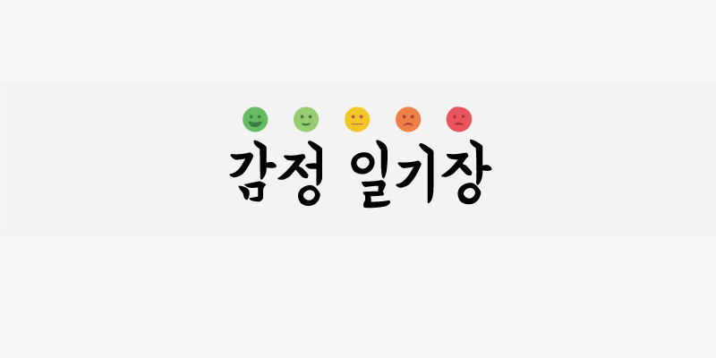
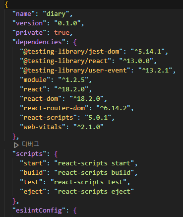
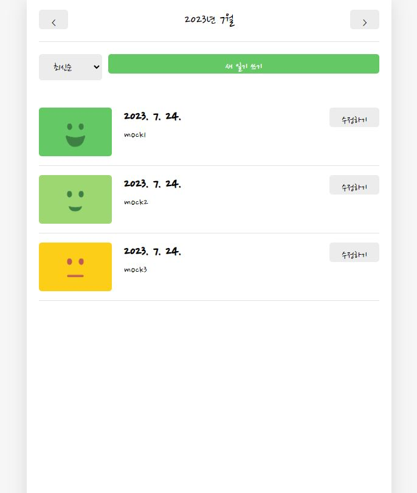
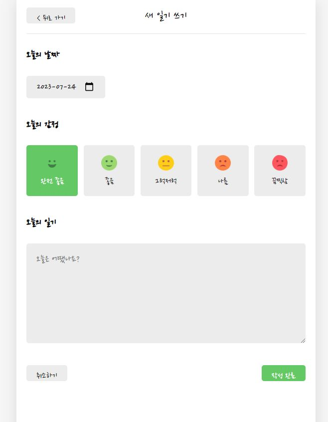
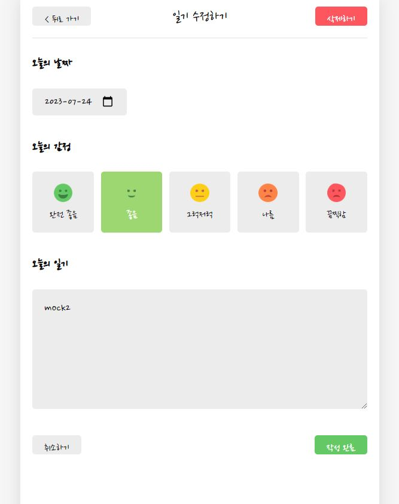
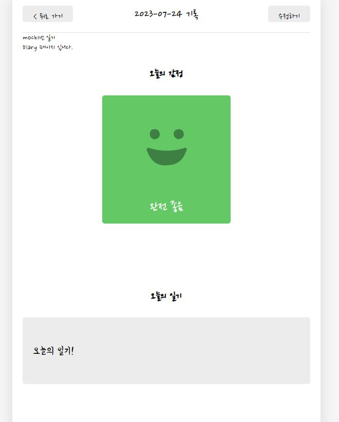

# 리액트 프로젝트 - 📝감정일기장<br><br>
<br>


### 🗓 프로젝트 제작 기간
<li> 2023.07.18 ~ 2023.07.24 (7일) <br/>

## 💻 모듈

```
> $ cd diary
> $ yarn add module
```

## 💻 실행 

```
> $ yarn start
> $ npm start
```

### 💻 기술 스택
<hr/>
 
 
 <br><br>


 


### 📚 구현한 기능
<hr/>
✔  일기장 작성하기<br>
✔  일기장 상세조회 하기(일기장 내용과 감정 이모티콘)<br>
✔  일기 정렬(최근 일기장, 제일 마지막에 작성한 일기장)<br>
✔  일기 내용, 감정 이모티콘 수정하기<br>
✔  작성했던 일기 삭제하기<br>
✔  월별로 작성한 일기 조회하기<br>

## 📔 메인화면
**작성한 일기를 조회하는 화면입니다.**



<li>작성된 일기가 있다면 최근과 제일 오래된 순으로 정렬을 할 수 있습니다.
<li> 저장된 일기가 없다면 새로운 일기를 작성할 수 있고 저장된 일기가 있다면 내용을 수정할 수 있습니다.
<li> 헤더 영역의 버튼을 조작하여 월별로 작성한 일기를 나눠서 볼 수 있습니다.
<br/>

## 📝 일기 작성 화면
**새로운 일기를 작성하는 화면입니다.**




<li> 첫 화면에서는 자동으로 오늘 날짜가 지정되며 날짜 선택도 가능합니다.
<li> 오늘의 감정을 이모티콘으로 저장하고 일기를 작성할 수 있습니다.

## 📝 일기 수정, 삭제 화면
**작성한 일기를 수정, 삭제하는 화면입니다.**



<li> 기존에 작성된 일기의 내용, 날짜, 감정 이모티콘을 수정할 수 있습니다.
<li> 현재 일기를 수정하는 화면에서 일기를 삭제할 수도 있습니다. 

## 📖 일기 상세 조회 화면
**작성한 일기의 내용, 감정 이모티콘을 상세 조회할 수 있는 화면입니다.**


<li> 작성했던 날짜, 감정 이모티콘, 작성했던 일기 내용을 하나의 화면에서 모두 조회할 수 있습니다.


